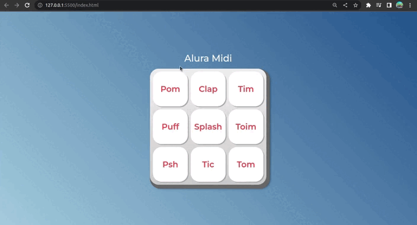

# AluraMidi

## Sobre:

O AluraMIDI é um projeto desenvolvido com paixão e dedicação para unir a música e a tecnologia. Com este repositório, você terá acesso a uma aplicação web interativa que emite sons autênticos de instrumentos de percussão ao tocar os botões correspondentes na tela.

Utilizando JavaScript, HTML e CSS, o projeto oferece uma interface amigável e responsiva, garantindo que tanto iniciantes quanto especialistas em música possam desfrutar dessa experiência musical única. Os sons autênticos dos instrumentos foram cuidadosamente selecionados para proporcionar uma experiência sonora de alta qualidade.

## Layout:



## Como executar o projeto?

Os passos para acessar o projeto são bem simples, mas seguem a seguinte ordem:

```bash
# Terminal

git clone https://github.com/MateusMaciel340/aluramidi

cd aluramidi/

```

## Tecnologias

As seguintes ferramentas foram utilizadas na construção do projeto:

### Frontend

- HTML
- CSS
- JavaScript

## Contribuidores

<table>
    <thead>
        <tr>
            <td>
                
            </td>
        </tr>
    </thead>
    <tbody>
        <tr>
            <th>Mateus Maciel</th>
        </tr>
    </tbody>
</table>

## Como contribuir?

1. Faça um fork do projeto.
2. Crie uma nova ramificação com suas alterações: `git checkout -b minha-feature`
3. Salve as alterações e crie uma mensagem de confirmação contando o que você fez: `git commit -m "arquivo modificado"`
4. Envie suas alterações: `git push origin minha-feature`

## Licença

Este projeto é licenciado sob a licença Alura Cursos.
